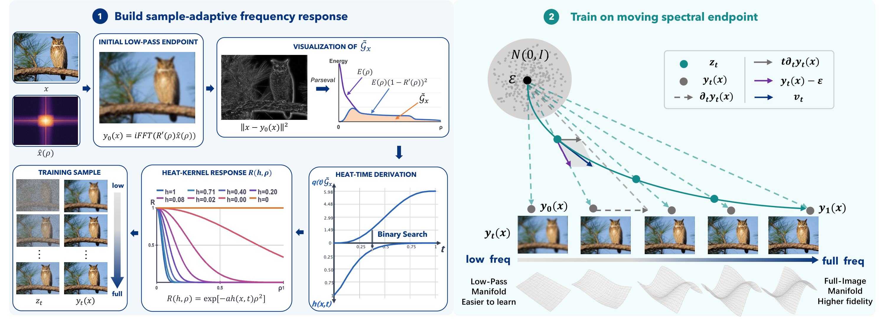

# Energy-Guided Flow Matching (EG-FM)

[](https://github.com/ysng123/EG-FM) [](https://arxiv.org/pdf/2608.05811) [](https://huggingface.co/ysng/EG-FM-ImageNet) [](https://huggingface.co/ysng/EG-FM-T2I)


Official code release for **[Energy-Guided Flow Matching (EG-FM)](https://arxiv.org/abs/2608.05811)**, including the reusable path library, the class-conditional PixelDiT-XL/16 implementations for ImageNet at 256×256 and 512×512, the text-conditioned PixelDiT implementation for text-to-image generation on BLIP3o, and two integration examples. PixelDiT is the directly runnable reference implementation: its entry points, models, scripts, and tests live in the repository root instead of a nested project.

EG-FM constructs the moving endpoint, its endpoint velocity, the training state, and the exact velocity target during training.

## Energy-Guided Flow Matching



EG-FM constructs an image-adaptive moving endpoint and its exact endpoint velocity. During training, the public API produces the interpolated state and its matching velocity target from clean images and sampled times:

```python
import torch
from egfm import EnergyGuidedPath, make_training_batch

path = EnergyGuidedPath(
    sigma0=3.5,
    curve="smootherstep",
    release_start=0.0,
    release_end=1.0,
)
t = torch.rand(images.shape[0], device=images.device, dtype=images.dtype)
flow = make_training_batch(images, t, path)

velocity = model(flow.state, flow.time, labels)
loss = (velocity - flow.velocity).square().mean()
```

The standalone library in [`egfm/`](egfm/) provides backbone-independent EG-FM path and objective utilities. It supports x-prediction conversion, explicit noise, non-square images, custom release schedules, and input validation. See [`egfm/README.md`](egfm/README.md) for the full API.

## Results

Our method achieves the following ImageNet 256×256 results on 50K generated samples using the ADM evaluation suite:

| Backbone | Epochs | FID↓ | sFID↓ | IS↑ | Precision↑ | Recall↑ |
|---|---:|---:|---:|---:|---:|---:|
| DeCo-XL/16 + EG-FM | 440 | 1.63 | 4.78 | 300.1 | 0.79 | 0.62 |
| HyperDiT-H + EG-FM | 220 | 1.51 | 4.31 | 293.4 | 0.78 | 0.64 |
| PixelDiT-XL + EG-FM | 80 | 1.99 | 5.09 | 280.8 | 0.81 | 0.61 |
| PixelDiT-XL + EG-FM | 200 | 1.55 | 4.60 | 296.2 | 0.79 | 0.65 |
| PixelDiT-XL + EG-FM | 600 | 1.45 | 4.41 | 299.6 | 0.78 | 0.65 |

At ImageNet 512×512, PixelDiT-XL + EG-FM reaches **1.68 FID** after 240 epochs, while HyperDiT-H + EG-FM reaches **1.58 FID** after 260 epochs. On text-to-image generation at 512×512, EG-FM-T2I reports **0.85 GenEval** and **83.9 DPG-Bench**.

## Environment

The reference environment uses Python 3.10, PyTorch 2.8.0, and bfloat16. Create a Python 3.10 Conda environment and install the requirements directly:

```bash
conda create -n egfm-pixeldit python=3.10 -y
conda activate egfm-pixeldit
python -m pip install -r requirements.txt
```

This repository discovers the bundled `egfm/src` automatically; only when migrating EG-FM to another project should you run `python -m pip install -e ./egfm`.

## Inference

Run distributed inference from the repository root to generate and evaluate 50K samples. The released [ImageNet checkpoints](https://huggingface.co/ysng/EG-FM-ImageNet) produce the following results:

| Backbone | Epochs | torch-fidelity FID↓ | ADM FID↓ |
|---|---:|---:|---:|
| PixelDiT-XL + EG-FM | 200 | 1.51 | 1.55 |
| PixelDiT-XL + EG-FM | 600 | 1.39 | 1.45 |

ADM and torch-fidelity are different evaluation implementations and their absolute values should not be compared directly.

Run inference with the following script. It uses `checkpoints/pixeldit600/checkpoint-600.pth` by default:

```bash
bash scripts/eval_pixeldit_imagenet256.sh
```

For a 512×512 checkpoint, run:

```bash
CHECKPOINT=/path/to/checkpoint-240.pth \
bash scripts/eval_pixeldit_imagenet512.sh
```

The 512×512 script uses the bundled ImageNet 512 FID statistics by default. Set
`FID_STATS=` to keep the generated images without calculating FID, or set it to
another compatible statistics file.

## Training

Train the first stage through checkpoint 160:

```bash
DATA_PATH=/path/to/imagenet \
OUTPUT_DIR=outputs/pixeldit_stage1 \
NPROC_PER_NODE=8 \
bash scripts/train_pixeldit_imagenet256.sh
```

Continue at learning rate `1e-5`. Use `EPOCHS=201` to stop after producing checkpoint 200, or use the default continuation endpoint for checkpoint 600:

```bash
DATA_PATH=/path/to/imagenet \
RESUME_CHECKPOINT=outputs/pixeldit_stage1/checkpoint-160.pth \
OUTPUT_DIR=outputs/pixeldit_stage2 \
NPROC_PER_NODE=8 \
bash scripts/train_pixeldit_imagenet256.sh
```

The reference configuration uses `sigma0=3.5`, `smootherstep`, release interval `[0,1]`, 16 bisection iterations, lognormal time sampling `sigmoid(N(0,1))`, velocity prediction, and REPA weight 0.5 at patch block 8.

Continue a 256×256 checkpoint at 512×512 resolution. By default the training
stop boundary is epoch 400, it uses a per-GPU batch size of 8, and writes to
`outputs/pixeldit_xl_imagenet512`:

```bash
DATA_PATH=/path/to/imagenet \
RESUME_CHECKPOINT=outputs/pixeldit_stage2/checkpoint-200.pth \
NPROC_PER_NODE=8 \
bash scripts/train_pixeldit_imagenet512.sh
```

The checkpoint's epoch determines the starting epoch; set `EPOCHS=241` when only
continuing through epoch 240. Following the reference JIT_Pixeldit run, the
default configuration uses a constant learning rate of `1e-5`, time shift 3,
seed 42, and online evaluation every 20 epochs with CFG 3.0 over `[0.1,0.9]`.

## Text-to-image

The complete PixelDiT-T2I training and inference implementation is available
under [`t2i/`](t2i/). It includes BLIP3o tar/WebDataset loading, frozen Gemma
conditioning, the EG-FM moving endpoint objective, dual EMA checkpoints, and
25-step FlowDPM sampling. See [`t2i/README.md`](t2i/README.md) for stage tables
and launch commands. The released checkpoint is available on
[Hugging Face](https://huggingface.co/ysng/EG-FM-T2I).

## EG-FM integration examples

Two integration examples are provided for [`JiT`](example/jit) and the complete [`PixelDiT`](example/pixeldit) repository, including both C2I and T2I. See [`example/README.md`](example/README.md) for setup and launch instructions.

## Citation

```bibtex
@article{tong2026energy,
  title   = {Energy-Guided Flow Matching},
  author  = {Tong, Haoyang and He, Yu and Li, Fang and Ma, Lichen and Fu, Jingling and Chen, Dong and Chen, Zhen and Huang, Junshi and Cao, Jie},
  journal = {arXiv preprint arXiv:2608.05811},
  year    = {2026}
}
```
